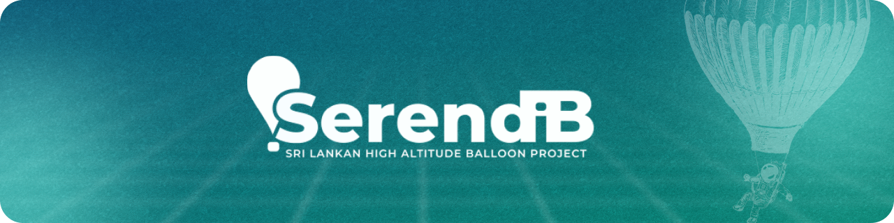

**Open-source, offline-first ground station and avionics ecosystem for High-Altitude Ballooning.**

[Missions](#missions) | [Core Components](#core-components-in-development) | [Sponsor](#support--sponsorship) | [Compliance](#legal-disclaimer--compliance) | [Get in Touch](#get-in-touch) | [Discussions](https://github.com/orgs/serendib-hab/discussions)

---

### Overview

Serendib HAB is an open-source hobby and educational initiative driven by university students and space enthusiasts under SEDS Sri Lanka (Students for the Exploration and Development of Space).

The project is dedicated to designing accessible software, radio telemetry pipelines, and modular avionics for scientific High-Altitude Balloon (HAB) educational flights reaching near-space altitudes (up to 30 km).

---

### Missions

* **Serendib 1.0** (Launched Dec 2020) : Sri Lanka's first scientific high-altitude balloon flight, capturing near-space imagery and telemetry.
* **Serendib 2.0** (Launched) : Advanced atmospheric payload testing, sensor characterization, and avionics validation.
* **Serendib 3.0** (Launching in 2026) : Next-generation educational mission featuring modular avionics, offline-first ground station software, and multi-station synchronization.

---

### Core Components (In Development)

* **serendib-station** : Offline-first edge ground station and telemetry ingest pipeline.
* **serendib-cloud** : Multi-station telemetry synchronization and consensus.
* **serendib-tracker** : Real-time 3D flight visualization and mission control interface.
* **serendib-avionics** : Modular flight computer firmware and sensor logging.
* **serendib-docs** : Architecture blueprints, packet specifications, and flight guides.

---

### Support & Sponsorship

If you would like to support our student-led high-altitude balloon missions, sensor development, and launches:

* **Buy Me a Coffee** : [buymeacoffee.com/sedssl](https://buymeacoffee.com/sedssl)
* **Hardware & In-Kind Sponsorship** : We welcome sponsorships for helium, RF modules, sensors, and avionics hardware. Contact [serendib@sedssl.org](mailto:serendib@sedssl.org) to partner with us.

---

### Legal Disclaimer & Compliance

* **Educational & Non-Commercial** : Serendib HAB is strictly a non-profit educational and hobby initiative developed by students for academic research and STEM outreach.
* **Regulatory Compliance** : All balloon flights, radio transmissions, and operations are conducted in accordance with applicable civil aviation authorities, national telecommunications guidelines, and amateur radio standards.
* **As-Is Disclaimer** : All open-source code, hardware references, and documentation are provided "as is" under the MIT license, without warranty of any kind. SEDS Sri Lanka and project contributors assume no liability for third-party implementation or use.

---

### Get in Touch

Whether you are a student, radio amateur, aerospace enthusiast, or developer, we welcome collaboration, ideas, and feedback.

* **Email** : [serendib@sedssl.org](mailto:serendib@sedssl.org)
* **Discussions** : Join the conversation on [GitHub Discussions](https://github.com/orgs/serendib-hab/discussions)
* **Organization** : Learn more at [SEDS Sri Lanka](https://sedssl.org)

---

Copyright © 2026 Serendib HAB. A student-led hobby initiative by <b>SEDS Sri Lanka</b>. All rights reserved.

