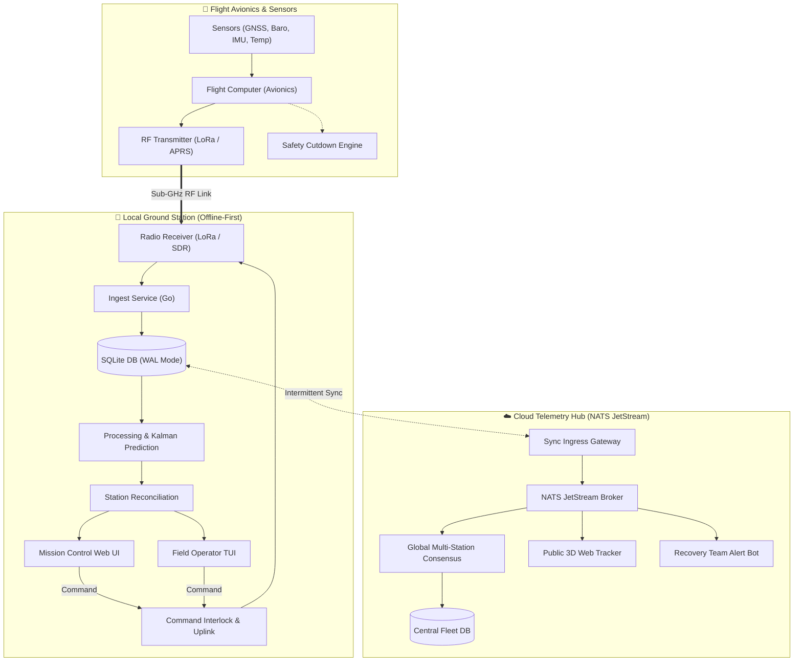

# 🎈 Serendib HAB
### *Ground Station Pipeline & Multi-Station Cloud Synchronization Platform*

  <b>Serendib HAB</b> is an open-source, high-reliability software and avionics ecosystem engineered for <b>High-Altitude Balloon (HAB) missions and near-space exploration</b>. Designed with an offline-first philosophy, Serendib enables autonomous local ground stations, real-time trajectory prediction, multi-station consensus, and mission control telemetry distribution.

---

[Explore Docs](https://github.com/serendib-hab) • [Architecture Guide](https://github.com/serendib-hab) • [Packet Specs](https://github.com/serendib-hab) • [Get Involved](#-contributing--community)

---

## 🌌 Key Highlights

<table>
  <tr>
    <td width="50%" valign="top">
      <h3>📡 Offline-First Ground Station</h3>
      <ul>
        <li><b>Zero-Dependency Field Operations:</b> Autonomous edge pipeline running full LoRa/FSK radio ingest, telemetry decoding, and command safety interlocks without internet connectivity.</li>
        <li><b>Append-Only Persistence:</b> Embedded SQLite in WAL mode ensuring every raw frame and demodulated metric is preserved non-destructively.</li>
        <li><b>Dynamic Trajectory Prediction:</b> Real-time ascent/burst/descent models integrating live atmospheric wind soundings and Kalman filtering.</li>
      </ul>
    </td>
    <td width="50%" valign="top">
      <h3>☁️ Multi-Station Cloud Mesh</h3>
      <ul>
        <li><b>High-Throughput Messaging:</b> NATS JetStream event broker distributing live telemetry frames with sub-millisecond latencies.</li>
        <li><b>Consensus & Deduplication:</b> Real-time packet reconciliation across globally distributed listener stations to maximize payload coverage.</li>
        <li><b>Downstream Gateways:</b> Real-time 3D web flight tracking, broadcast live stream overlays, and automated recovery alerts via Telegram.</li>
      </ul>
    </td>
  </tr>
  <tr>
    <td width="50%" valign="top">
      <h3>📦 Avionics & Science Payloads</h3>
      <ul>
        <li><b>Modular Payload Architecture:</b> Support for multi-band RF (LoRa, FSK, APRS), GNSS tracking, and secondary payload buses (I2C/SPI/UART).</li>
        <li><b>Atmospheric Sensing:</b> High-resolution barometric altitude, thermal gradients, cosmic radiation monitoring, and onboard cameras.</li>
        <li><b>Power & Cutdown Systems:</b> Energy-efficient power budgeting with thermal management and failsafe geo-fenced cutdown mechanisms.</li>
      </ul>
    </td>
    <td width="50%" valign="top">
      <h3>🛡️ Safety, Security & Telemetry Specs</h3>
      <ul>
        <li><b>Compact 32-Byte Binary Framing:</b> Maximizes RF link budget, coding gain, and airtime efficiency over long-range LoRa links.</li>
        <li><b>Deterministic Command Interlocks:</b> Cryptographically verified command uplink with multi-stage armed confirmations and hardware failsafes.</li>
        <li><b>Audit Logs:</b> End-to-end immutability for post-flight incident analysis and scientific dataset extraction.</li>
      </ul>
    </td>
  </tr>
</table>

---

## 🏛️ System Architecture

---

## 📂 Core Ecosystem Repositories

| Repository | Description | Primary Stack | Status |
|---|---|---|---|
| [`serendib-docs`](https://github.com/serendib-hab) | Architectural blueprints, mathematical flight models, specs & interactive guides | VitePress, Markdown, Mermaid | 🟢 Active |
| [`serendib-station`](https://github.com/serendib-hab) | Offline-first edge ground station, binary radio ingest & SQLite storage engine | Go, SQLite (WAL), Python, C++ | 🟢 Active |
| [`serendib-cloud`](https://github.com/serendib-hab) | Multi-station telemetry sync, NATS JetStream pub/sub & recovery dispatcher | Go, NATS, TypeScript, Docker | 🟡 In Development |
| [`serendib-tracker`](https://github.com/serendib-hab) | Real-time 3D flight visualization, mission control UI & chase vehicle dashboard | Vue / Vite, Cesium / Mapbox, TS | 🟡 In Development |
| [`serendib-avionics`](https://github.com/serendib-hab) | Flight computer firmware, power management, sensor drivers & cutdown controllers | C / C++, FreeRTOS, Embedded C | 🔵 Planned |

---

## 🛠️ Technology Stack

| Domain | Technologies & Protocols |
|---|---|
| **Core & Edge Ingest** | `Go` • `Python` • `C++` • `SQLite (WAL)` • `LoRa / SX127x / SX126x` |
| **Cloud & Messaging** | `NATS JetStream` • `PostgreSQL / TimescaleDB` • `Docker` • `gRPC / Protobuf` |
| **Frontend & Visualization** | `TypeScript` • `Vue.js` • `Vite` • `TailwindCSS` • `Mapbox / OpenLayers` |
| **Avionics & Embedded** | `STM32 / ESP32` • `FreeRTOS` • `SPI / I2C / UART` • `GNSS (NMEA / UBX)` |
| **Documentation & CI/CD** | `VitePress` • `GitHub Actions` • `Mermaid.js` |

---

## 🤝 Contributing & Community

We welcome contributions from ballooning enthusiasts, radio amateurs, aerospace engineers, and software developers!

- 📖 **Read the Docs:** Explore architecture specifications and binary protocol definitions.
- 🐛 **Report Issues:** Found a bug or have a suggestion? Open an issue on any of the respective repositories.
- 💡 **Discussions:** Join technical discussions on telemetry protocols, flight dynamics, and RF links.

---

Built with ❤️ by the Serendib HAB Engineering Team • Dedicated to open near-space exploration and scientific research.

